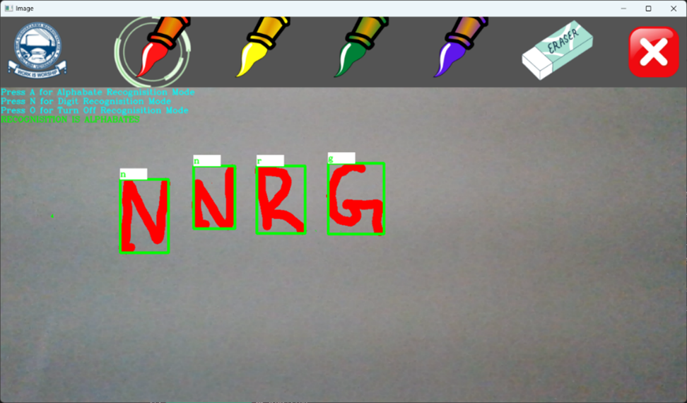
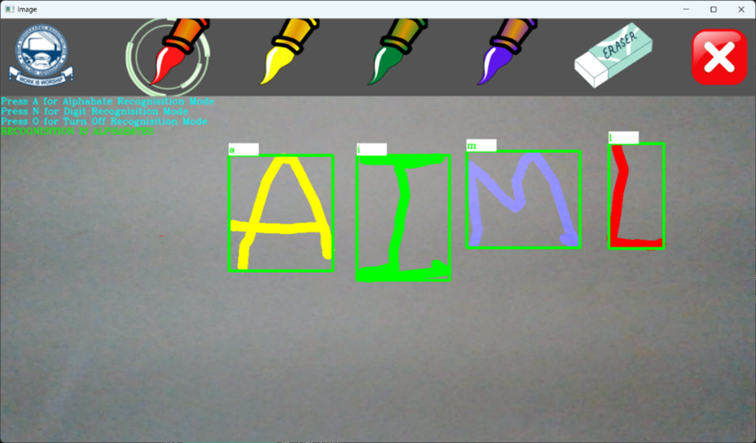
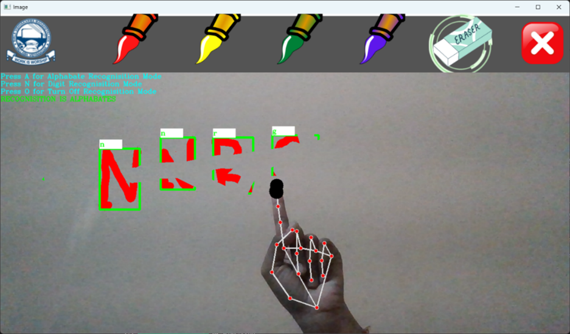

# Free-Hand Air Writing and Character Recognition

This project allows users to write alphabets and digits in the air using their index finger. A webcam tracks the fingertip using MediaPipe, draws the strokes using OpenCV, and predicts the written character using CNN models.

---

## Features
- Real-time hand & fingertip tracking
- Air writing using webcam
- Draw on a virtual canvas
- Recognizes A–Z alphabets and 0–9 digits
- Multi-color drawing support
- Eraser tool
- Alphabet mode, Number mode, and Off mode
- Contactless and user-friendly

---

## Output Screens

### Alphabet Recognition – “NNRG”


### Alphabet Recognition – “AIML”


### Hand Tracking With Recognition


---

## How It Works
1. Webcam captures live video.
2. MediaPipe detects hand landmarks.
3. Fingertip motion is tracked and drawn on a virtual canvas.
4. Drawn strokes are preprocessed.
5. CNN model predicts the character.
6. Output shown in real time.

---

## Installation
```bash
git clone https://github.com/tharuni2503/Free-Hand-Air-Writing-and-Character-Recognition.git
cd Free-Hand-Air-Writing-and-Character-Recognition
pip install -r requirement.txt
